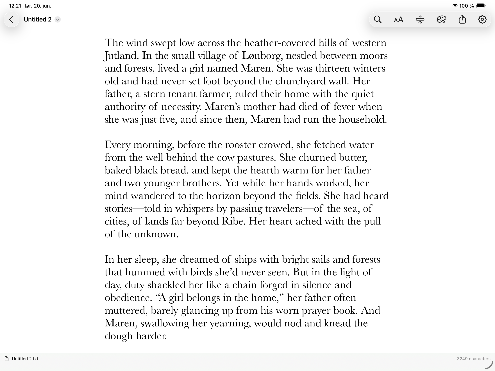

# NiceTextEditor Mobile

Version 0.0.1 prototype of a native plain-text editor for iPad and iPhone, based on the design analysis in `design/ipados-ios-port-analysis.html`.

This first version intentionally excludes the macOS app's MPW/worksheet shell features and Go To Line.



## Features in 0.0.1

- SwiftUI document-based iPadOS/iOS app.
- Opens and saves plain-text documents through the system document browser / Files.
- Reads UTF-8, UTF-16, and MacRoman text; writes UTF-8.
- UIKit `UITextView` editing surface wrapped in SwiftUI.
- Standard editing behavior: selection, undo/redo, spelling, autocorrection, keyboard input, accessibility.
- System find navigator via `UIFindInteraction` on supported iOS versions.
- Text size menu with keyboard shortcuts.
- Global font chooser in app Settings using the standard iOS font picker; the chosen font is remembered between launches.
- Toolbar text-width presets: 100%, 80%, and 60%.
- NiceTextEditor app icon adapted from the macOS project.
- Small theme picker.
- Character count status bar.
- Share sheet for the current file or untitled text.

## Requirements

- Xcode 26 or newer was used to create and validate the project.
- iOS/iPadOS deployment target: 17.0.

## Open in Xcode

```sh
open NiceTextEditorMobile.xcodeproj
```

Select an iPhone or iPad simulator and press Run.

## Build from the command line

List schemes:

```sh
xcodebuild -list -project NiceTextEditorMobile.xcodeproj
```

Build for an iPad simulator:

```sh
xcodebuild \
  -project NiceTextEditorMobile.xcodeproj \
  -scheme NiceTextEditorMobile \
  -destination 'platform=iOS Simulator,name=iPad Pro 13-inch (M4),OS=18.5' \
  build
```

If that exact simulator is not installed, list available devices:

```sh
xcrun simctl list devices available
```

Then replace the `-destination` value with one of your installed simulators.

## Notes

- The app uses the system document browser. In the simulator you can create a new document from the app's document UI, or share/copy text files into the simulator's Files app.
- The chosen font is global for all documents because that is the simplest and most predictable persistence model for the first version.
- Line numbers and visual-only `.VB` / `.VE` or `.QB` / `.QE` rendering are intentionally deferred beyond 0.0.1.
